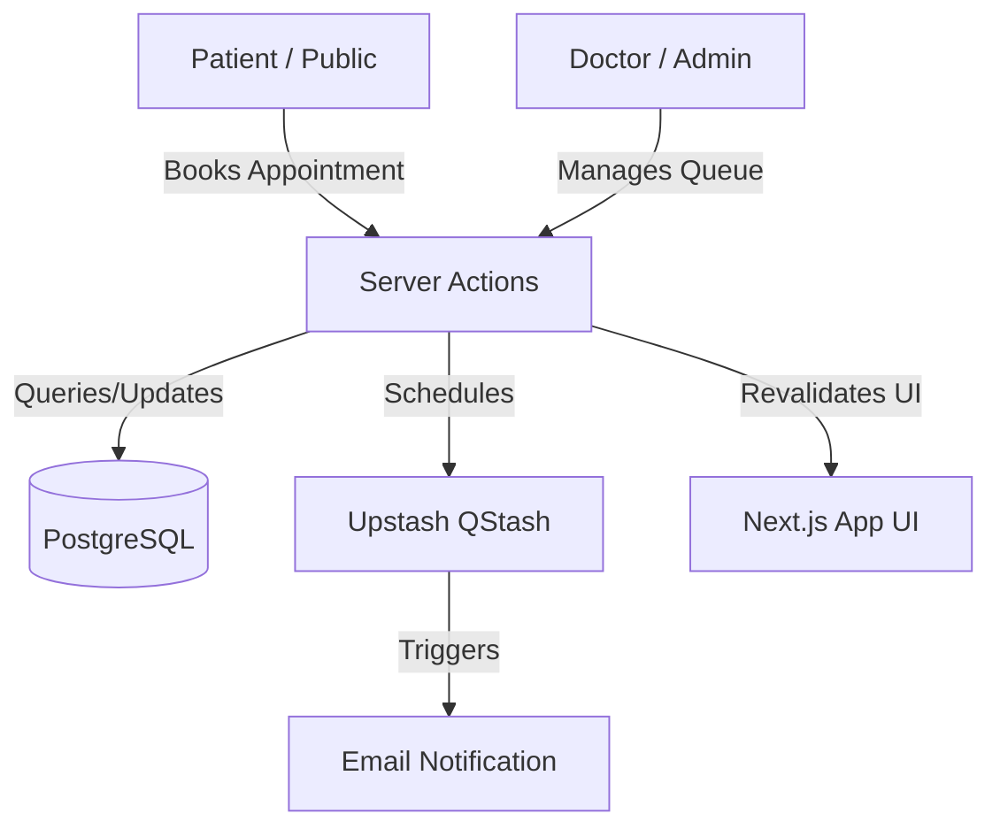

# 🏥 HealthCore Clinic - Project Workflow & Architecture

This document provides a comprehensive overview of the **HealthCore Clinic** appointment and queue management system. It covers the technical stack, codebase structure, and detailed workflows for different user roles.

---

## 🚀 1. Project Overview

HealthCore Clinic is a modern web application designed to streamline the patient booking process, manage clinic doctor workflows, and provide a real-time queue display for patients. It minimizes physical waiting times and automates communication through smart reminders.

### Key Goals:

- **Simplify Booking**: Easy-to-use public interface for patients to request appointments.
- **Automated Communication**: Instant email confirmations and scheduled reminders (30 min before & exact time).
- **Live Queue Tracking**: High-impact visual and audio alerts (including voice synthesis) for patients when they are called.
- **Efficient Clinic Management**: Redesigned 2-column Doctor Console featuring live queue monitoring, today's schedule summaries, and instant arrival notifications.

---

## 🛠 2. Technology Stack

The project is built using a high-performance, modern stack:

| Technology                  | Purpose                                                                  |
| :-------------------------- | :----------------------------------------------------------------------- |
| **Next.js 15 (App Router)** | Full-stack React framework for SSR and Server Actions.                   |
| **TypeScript**              | Type-safe development for both frontend and backend logic.               |
| **Drizzle ORM**             | Lightweight and performant TypeScript ORM for database interaction.      |
| **PostgreSQL**              | Relational database for structured data (Patients, Appointments, Users). |
| **Tailwind CSS**            | Utility-first CSS framework for modern, responsive UI design.            |
| **Lucide React**            | Premium icon set for visual indicators and navigation.                   |
| **Upstash QStash**          | Serverless scheduling for automated appointment reminders.               |
| **Resend / Nodemailer**     | Reliable email delivery for patient notifications.                       |

---

## 🏗 3. Core Architecture

The application follows a modular architecture using Next.js Server Actions for backend logic and Drizzle for data persistence.

### High-Level Data Flow:



### Database Schema (`/db/schema.ts`):

- **`patients`**: Stores basic patient info (Name, Phone, Email, Reason for Visit).
- **`appointments`**: Tracks appointment state (`requested`, `scheduled`, `arrived`, `called`, `completed`), dates, and times.
- **`users`**: Role-based access for `doctor` and `admin`.
- **`settings`**: Global clinic flags (e.g., Doctor Status: Consulting/Resting).

---

## 🔄 4. Detailed Workflows

### A. Patient Workflow (The Journey)

1.  **Booking**: Patient visits the home page and fills out the booking form.
    - _Logic_: `createBooking` action checks if the patient exists (via phone), creates/retrieves ID, and inserts a `requested` appointment.
2.  **Confirmation & Reminders**: Once scheduled by a doctor, the patient receives:
    - **Instant**: "Appointment Confirmed" email.
    - **30 Min Before**: Reminder email.
    - **Exact Time**: Final reminder.
3.  **Check-In**: Upon arrival at the clinic, the patient checks in via the `/checkin` page.
    - _Logic_: Changes status from `scheduled` to `arrived`.
4.  **Queue Monitoring**: Patient watches the `/queue` screen.
    - _Feature_: Real-time updates with audio alerts when their name is called.

### B. Doctor Workflow

The Doctor Dashboard (`/doctor/dashboard`) is the nerve center for clinical operations.

- **Appointment Management**: Reviewing incoming requests and assigning dates/times with a precise 12-hour clock (AM/PM) and minute-by-minute selection.
- **Patient Calling**: Clicking "Call" moves the appointment to `called` status, triggering a massive full-screen announcement on the Public Queue.
- **Smart Notifications**: The dashboard alerts the doctor with sound and visual pulses whenever a new request arrives or a patient enters the lobby.
- **Status Control**: Doctors can toggle their state between `Consulting` and `Resting`, which updates the public Queue display.
- **Reappointments & Dismissal**: Doctors can schedule the next visit directly or dismiss follow-ups with a single click if no further visit is needed.

### C. Admin Workflow (Admissions)

The Admin Panel (`/admin`) focuses on intake and data integrity.

- **Approval**: Converting `requested` appointments into `scheduled` slots.
- **Rejection**: Removing invalid or duplicated requests.
- **System Seeding**: Admin can trigger `seedAccounts` to ensure system users (Doctor/Admin) are created.

---

## 💻 5. Key Technical Implementations

### Automated Reminders (`/lib/scheduler.ts`)

Uses Upstash QStash to handle delayed executions. When an appointment is scheduled:

```typescript
// From /app/actions.ts
await scheduleReminder(id, name, email, thirtyMinBefore, '30min');
await scheduleReminder(id, name, email, scheduledAt, 'exact');
```

This ensures emails are sent even if the clinic dashboard is closed.

### Authentication (`/lib/auth.ts`)

A custom JWT-based authentication system using `jose` and encrypted cookies.

- **`login`**: Creates a session with encrypted payload (Email, ID, Role).
- **`getSession`**: Decrypts and validates the cookie for every protected Server Action.

### Real-Time Queue (`/app/queue/page.tsx`)

- **`AutoRefresh`**: A client component that triggers a router refresh every 15-30 seconds.
- **`QueueAudioAlert`**: A flashy announcement system that triggers a high-impact full-screen overlay, plays a chime, and uses text-to-speech to call the patient's name.
- **`DashboardNotifier`**: A doctor-side alertness system that provides audible and visual feedback for incoming events.

---

## 🚦 6. Getting Started

### Environment Variables (.env)

Required keys for full functionality:

- `DATABASE_URL`: PostgreSQL connection string.
- `AUTH_SECRET`: Secret for session encryption.
- `SMTP_EMAIL` & `SMTP_PASSWORD`: For Gmail-based email delivery.
- `DISABLE_EMAILS`: Set to `true` to pause email notifications during development.

### Execution

```bash
npm install     # Install dependencies
npm run dev     # Launch local development server
```

---
